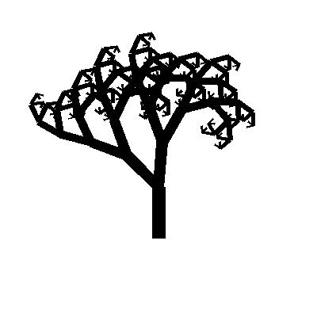

Fractal rendering
============
A [fractal](https://en.wikipedia.org/wiki/Fractal) is a self-similar pattern that is observable at any scale.

Barnsley Fern
--------

The [Barnsley Fern](https://en.wikipedia.org/wiki/Barnsley_fern) is a fractal image concept created by Michael Barnsley that achieves the fractal status through replicating a point in four matrices with the appliance of slight shiftings through a large number of iterations.

Koch Snowflake
--------

The [koch snowflake](https://en.wikipedia.org/wiki/Koch_snowflake) is a fractal image concept created by the mathematician Helge von Koch. It achieves the fractal status through creating an equilateral triangle, then dividing its lines into four equally-sized lines forming a spike - iteratively.

Pytagoras Tree
--------

The [Pythagoras Tree](https://en.wikipedia.org/wiki/Pythagoras_tree_(fractal)) is a fractal image concept created by the mathematician Albert E. Bosman and named after the ancient greek mathematician Pytagoras. It achieves the fractal status through having a vertical straight line that splits to two diagonal lines, which in turn split by two lines each, for a certain number of iterations.
